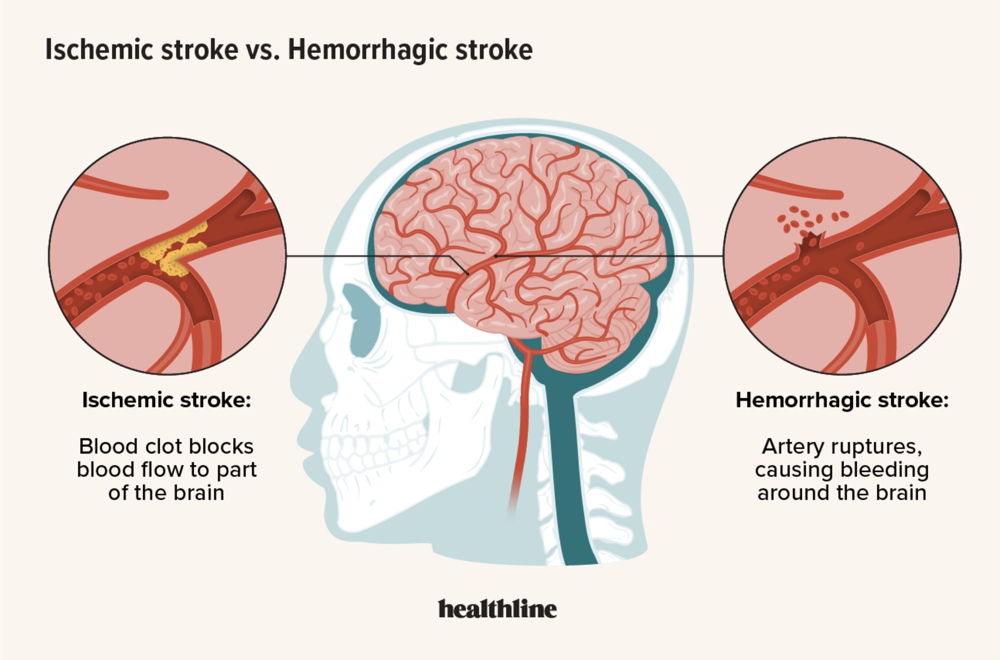
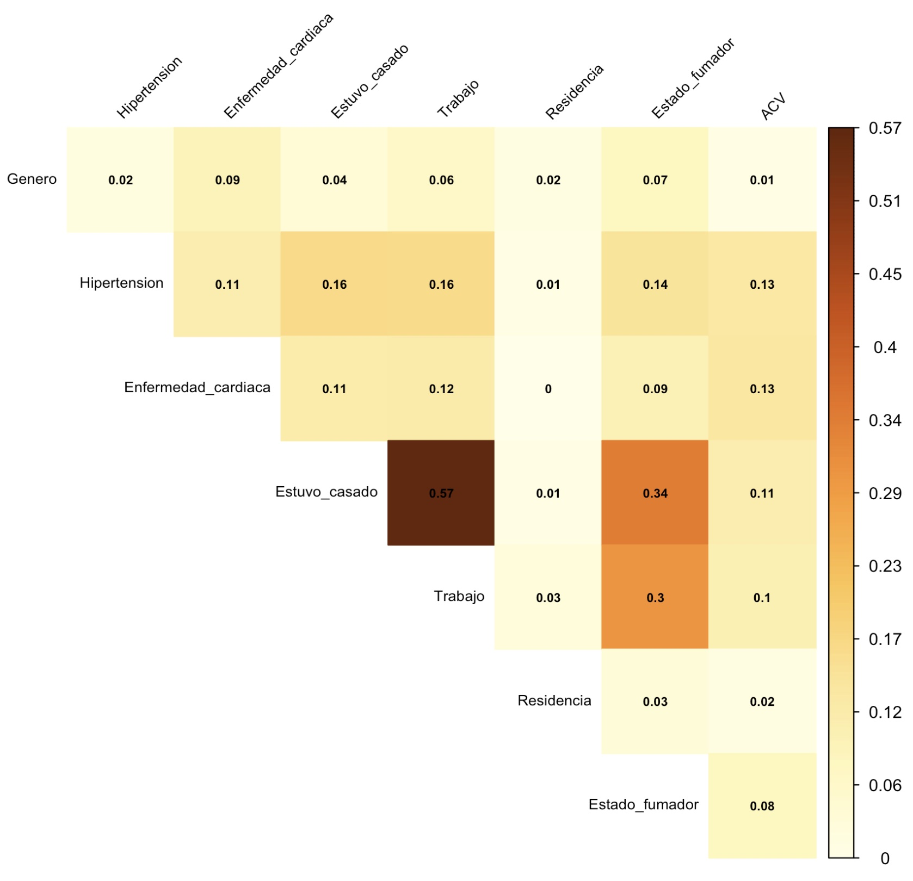
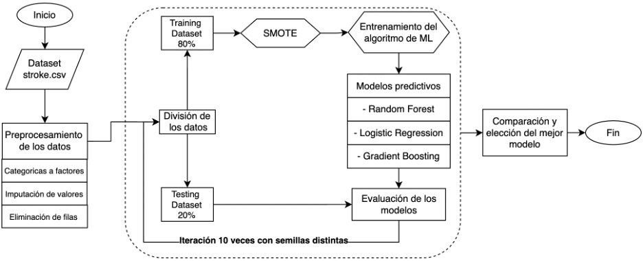
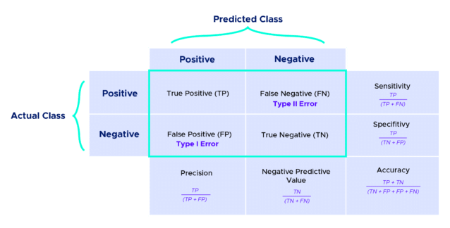
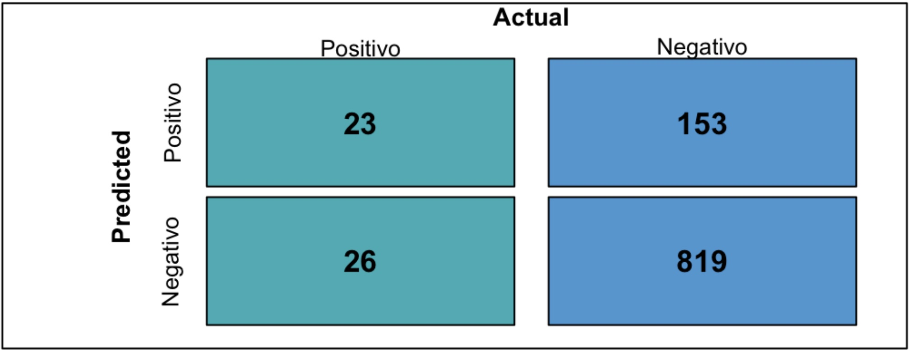
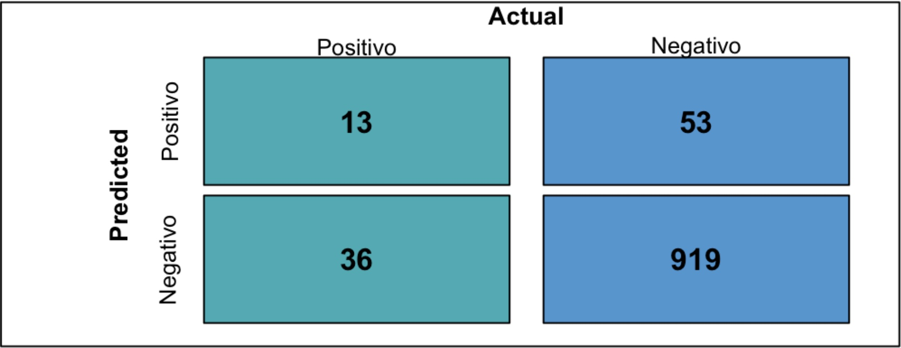

```{r global, include = FALSE} 
library(flexdashboard)
library(shiny)
library(readr)
library(caret) # models, createDataPartition
library(ConfusionTableR)
library(DataExplorer)
library(dplyr)
library(ggplot2)
library(ggthemes)
library(kableExtra)
library(ModelMetrics)
library(openxlsx)
library(plotly)
library(probably) # for balancing performance
library(pROC) # AUC
library(psych)
library(purrr) # map
library(randomForest)
library(reshape2)
library(skimr) # descriptive stats
library(stringr)
library(tidymodels)
library(tidyverse) # %>%
library(univariateML)
library(vip) # for variable importance
library(xgboost)
library(WRS2)
library(knitr)
library(nortest)
library(vcd) # assocstats, coef de Cramer
library(tidyr)
library(viridis)
library(naniar)
```

```{r}
data = read_csv("stroke.csv")
resultados_Random_Forest = read.xlsx("model_comparison.xlsx",
                                     sheet = "Random_Forest")
resultados_Logistic_Regression = read.xlsx("model_comparison.xlsx",
                                           sheet = "Logistic_Regression")
resultados_Gradient_Boosting = read.xlsx("model_comparison.xlsx",
                                         sheet = "Gradient_Boosting")
resultados_Comparative_Results = read.xlsx("model_comparison.xlsx",
                                           sheet = "Comparative_Results")
imp_rf = read.xlsx("model_imp.xlsx", sheet = "imp_rf")
imp_lr = read.xlsx("model_imp.xlsx", sheet = "imp_lr")
imp_gbm = read.xlsx("model_imp.xlsx", sheet = "imp_gbm")
```

# Introducción

## Column {data-width=250}

### Accidente Cerebovascular:

- Segunda causa de muerte a nivel mundial (OMS).

- Tipos.

- Efectos: sociales, emocionales y económicos. 

- Factores de riesgo y prevención.

- Diagnóstico: BE-FAST / Tomografías / Resonancias.

- Machine learning.

- Objetivos: EDA, estadísticos y modelos predictivos. 

### Tipos de ACV: {data-width=250}



## Column {data-width=250}

### Factores de riesgo:


### BE-FAST


# Datos crudos {data-navmenu="Datos"}

### Datos crudos:

```{r}
DT::datatable(data,
              rownames = F,
              options = list(pEdadLength = 10, scrollX = TRUE),
              class = "white-space: nowrap")
```

# Datos faltantes {data-navmenu="Datos"}

```{r}
data$bmi <- as.integer(data$bmi)
vis_miss(data, facet = stroke)
```

# Datos procesados {data-navmenu="Datos"}

### Datos procesados: 

```{r}
data = data %>% 
  rename(
    Genero = gender,
    Estuvo_casado = ever_married,
    Trabajo = work_type,
    Residencia = Residence_type,
    Estado_fumador = smoking_status,
    Hipertension = hypertension,
    Enfermedad_cardiaca = heart_disease,
    Edad = age,
    Nivel_prom_glucosa = avg_glucose_level,
    IMC = bmi,
    ACV = stroke
  ) 

data = data %>%
  mutate(
    Genero = factor(Genero, levels = c("Female", "Male","Other"), 
                    labels = c("Femenino", "Masculino", "Otro")),
    Estuvo_casado = factor(Estuvo_casado, levels = c("No", "Yes"), 
                           labels = c("No", "Si")),
    Trabajo = factor(Trabajo, levels = c("children", "Govt_job", "Never_worked", "Private", "Self-employed"), 
                     labels = c("Niño", "Gobierno", "Nunca trabajo", "Privado", "Autónomo")),
    Residencia = factor(Residencia, levels = c("Rural", "Urban"), 
                        labels = c("Rural", "Urbana")),
    Estado_fumador = factor(Estado_fumador, levels = c("formerly smoked", "never smoked", "smokes", "Unknown"), 
                            labels = c("Ex fumador", "Nunca fumo", "Fuma", "Desconocido")),
    Hipertension = factor(Hipertension, levels = c(1,0), 
                          labels = c("Si", "No")),
    Enfermedad_cardiaca = factor(Enfermedad_cardiaca, levels = c(1,0), 
                                 labels = c("Si", "No")),
    ACV = factor(ACV, levels = c(1,0), 
                 labels = c("Positivo", "Negativo"))
  )
```

```{r}
df1 <- data
df1 <- subset(df1, select = (-id)) 
df1$IMC <- as.integer(df1$IMC)
categoricas = c("Genero", "Hipertension", "Enfermedad_cardiaca", "Estuvo_casado", "Trabajo", "Residencia", "Estado_fumador", "ACV")
for (col in categoricas) {
  df1[[col]] = as.factor(data[[col]])
}
med <- median(df1$IMC, na.rm = TRUE)
df1$IMC[is.na(df1$IMC)] <- med
df1 <- df1 %>% filter(Genero != "Otro") %>% droplevels()

DT::datatable(df1,
              rownames = FALSE,
              options = list(pEdadLength = 12, scrollX = TRUE),
              class = "white-space: nowrap")
```

# Dataset {data-navmenu="Gráficos"}

### Porcentajes de casos positivos vs negativos para ACV:

```{r}
count_ACV <- table(df1$ACV)
porcentaje_ACV <- as.data.frame(count_ACV)
names(porcentaje_ACV) <- c("ACV", "n")
porcentaje_ACV$porcentaje <- porcentaje_ACV$n / sum(porcentaje_ACV$n) * 100
porcentaje_ACV$etiqueta <- sprintf("ACV %s: %.1f%% (%d)", porcentaje_ACV$ACV, porcentaje_ACV$porcentaje, porcentaje_ACV$n)
ggplot_colors <- hue_pal()(2)
colors <- setNames(ggplot_colors, as.character(unique(porcentaje_ACV$ACV)))
plot_ly(porcentaje_ACV, labels = ~etiqueta, values = ~porcentaje, 
        type = 'pie', marker = list(colors = colors)) 
```

# Variables categóricas {data-navmenu="Gráficos"}

## Inputs {.sidebar}

### 

```{r}
data1 = df1 %>% dplyr::select(-c("Edad","Nivel_prom_glucosa","IMC","ACV"))
choices1 = names(data1[sapply(data1, is.factor)])
selectInput('x', # saved as
            label = 'Selecciona una variable categórica:',
            choices = choices1,
            selected = choices1[[1]])
```

## Gráficos categóricos

###

```{r}
renderPlotly({
  ggplotly(
  ggplot(df1, aes_string(x = input$x, fill = "factor(ACV)")) +
  geom_bar(alpha = 0.5,position = "dodge") +  
  facet_grid(~ input$x)  +
  labs(title = paste("Distribución de", input$x, "por status de ACV"),
       fill = "ACV",
       x = input$x,
       y = "Conteo") + 
  theme_minimal()) 
})
```

### 

```{r}
renderPlotly({
  
  # Calcular los porcentajes dentro de cada grupo de la variable seleccionada
  df_percent <- df1 %>%
    group_by_at(input$x) %>%
    count(ACV) %>%
    mutate(percentage = n / sum(n)) %>%
    ungroup()
  
  # Crear el gráfico
  p <- ggplot(df_percent, aes_string(x = input$x, y = "percentage", fill = "factor(ACV)")) +
    geom_bar(stat = "identity", alpha = 0.5, position = "dodge") +  
    geom_text(aes(label = scales::percent(percentage)),
              position = position_dodge(width = 0.9), vjust = -0.5) +
    labs(title = paste("Proporción de", input$x, "por status de ACV"),
         fill = "ACV",
         x = input$x,
         y = "Porcentaje") + 
    scale_y_continuous(labels = scales::percent_format()) +
    theme_minimal()
  
  ggplotly(p)
})
```

# Variables categóricas (Positivos) {data-navmenu="Gráficos"}

## Inputs {.sidebar}

### 

```{r}
data1 = df1 %>% dplyr::select(-c("Edad","Nivel_prom_glucosa","IMC","ACV"))
choices1 = names(data1[sapply(data1, is.factor)])
selectInput('x', # saved as
            label = 'Selecciona una variable categórica:',
            choices = choices1,
            selected = choices1[[1]])
```

## Gráficos categóricos

###
```{r}
renderPlotly({
  ACV_positive <- df1 %>% filter(ACV == "Positivo")

  data_proportion <- ACV_positive %>%
    group_by_at(vars(input$x)) %>%
    summarise(prop = n() / nrow(ACV_positive)) %>%
    ungroup()

  ggplotly(ggplot(data_proportion, aes_string(x = input$x, y = "prop", fill = input$x)) +
    geom_col(alpha = 0.5) +
    labs(title = paste("Proporción de", input$x, "que tuvo ACV positivo"),
      x = input$x, y = "Proporción") +
    theme_minimal())
})
```

# Variabes numéricas {data-navmenu="Gráficos"}

## Inputs {.sidebar}

### 

```{r}
data2 = df1 %>% dplyr::select(-c("Genero", "Hipertension", "Enfermedad_cardiaca", "Estuvo_casado", "Trabajo", "Residencia", "Estado_fumador"))
choices2 = names(data2[sapply(data2, is.numeric)])
selectInput('y', # saved as
            label = 'Selecciona una variable numérica:',
            choices = choices2,
            selected = choices2[[1]])
```

## Gráficos numéricos

### 

```{r}
renderPlotly({
  ggplotly(
  ggplot(df1, aes_string(x = input$y, fill = "factor(ACV)")) +
  geom_histogram(alpha = 0.5, bins = 30, position = "identity") +  
  labs(
       fill = "ACV",
       x = input$y,
       y = "Conteo") + 
  theme_minimal()) 
})
```

### 

```{r}
renderPlotly({
  ggplotly(
  ggplot(df1, aes_string(x = input$y, fill = "factor(ACV)")) +
  geom_density(alpha = 0.5) +  
  labs(
       fill = "ACV",
       x = input$y,
       y = "Conteo") + 
  theme_minimal()) 
})
```

### 

```{r}
renderPlotly({
  ggplotly(ggplot(df1, aes_string(x = "ACV", y = input$y, fill = "ACV")) +
    geom_boxplot(alpha = 0.5, position = position_dodge(width = 0.8)) +
    labs(
      y = input$y, fill = "ACV")+
    theme_minimal()) 
})
```


# Edad Vs Categóricos {data-navmenu="Gráficos"}

## Inputs {.sidebar}

###

```{r}
data1 = df1 %>% dplyr::select(-c("Edad","Nivel_prom_glucosa","IMC","ACV"))
choices1 = names(data1[sapply(data1, is.factor)])
selectInput('x', # saved as
            label = 'Selecciona una variable categórica:',
            choices = choices1,
            selected = choices1[[1]])
```

## Graficos de Edad Vs variables categoricas 

En este apartado podremos ver la relación de la edad con las distintas variables categoricas. 

###

```{r}
renderPlotly({
    plot_ly(data = df1, x = ~get(input$x), y = ~Edad, color = ~ACV, colors = colors, type = "box") %>%
    layout(title = paste("Boxplot de Edad por", input$x, "por status de ACV."),
           xaxis = list(title = input$x),
           yaxis = list(title = "Edad"),
           boxmode = "group")
})
```

# NPG Vs Categóricos {data-navmenu="Gráficos"}

## Inputs {.sidebar}

###

```{r}
data1 = df1 %>% dplyr::select(-c("Edad","Nivel_prom_glucosa","IMC","ACV"))

choices1 = names(data1[sapply(data1, is.factor)])

selectInput('x', # saved as
            label = 'Selecciona una variable categórica:',
            choices = choices1,
            selected = choices1[[1]])
```

## Graficos de NPG Vs variables categoricas 

En este apartado podremos ver la relación de el nivel de glucosa con las distintas variables categoricas. 

### 

```{r}
renderPlotly({
    plot_ly(data = df1, x = ~get(input$x), y = ~Nivel_prom_glucosa, color = ~ACV, colors = colors, type = "box") %>%
    layout(title = paste("Boxplot de AGL por", input$x, "por status de ACV."),
           xaxis = list(title = input$x),
           yaxis = list(title = "AGL"),
           boxmode = "group")
})
```

# IMC Vs Categóricos {data-navmenu="Gráficos"}

## Inputs {.sidebar}

###

```{r}
data1 = df1 %>% dplyr::select(-c("Edad","Nivel_prom_glucosa","IMC","ACV"))

choices1 = names(data1[sapply(data1, is.factor)])

selectInput('x', # saved as
            label = 'Selecciona una variable categórica:',
            choices = choices1,
            selected = choices1[[1]])
```

## Graficos de IMC Vs variables categoricas 

En este apartado podremos ver la relación de el indice de masa corporal con las distintas variables categoricas. 

###

```{r}
renderPlotly({
    plot_ly(data = df1, x = ~get(input$x), y = ~IMC, color = ~ACV, colors = colors, type = "box") %>%
    layout(title = paste("Boxplot de IMC por", input$x, "por status de ACV."),
           xaxis = list(title = input$x),
           yaxis = list(title = "IMC"),
           boxmode = "group")
})
```

# Numéricas Vs Numéricas {data-navmenu="Gráficos"}

###

```{r}
ggplotly(ggplot(df1, aes(x = Edad, y= IMC, color = ACV)) +
  geom_point()+
  theme_clean() +
  labs(x = "Edad",
       y = "IMC"))
```

###

```{r}
ggplotly(ggplot(df1, aes(x = Nivel_prom_glucosa, y = Edad, color = ACV)) +
  geom_point()+
  theme_clean() +
  labs(x = "Nivel de glucosa",
       y = "Edad"))
```

###

```{r}
ggplotly(ggplot(df1, aes(x = IMC, y = Nivel_prom_glucosa, color = ACV)) +
  geom_point()+
  theme_clean() +
  labs(x = "IMC",
       y = "Nivel de glucosa"))
```


# Variables categóricas {data-navmenu="Estadísticos"}

### Estadísticos de las variables categóricas. 

```{r}
cat_vars = c("Genero", "Hipertension", "Enfermedad_cardiaca", "Estuvo_casado", "Trabajo", "Residencia", "Estado_fumador")

format_p_value <- function(p) {
  if (p < .001) {
    return("&lt;.001")
  } else if (p < .01) {
    return(sprintf("%.3f", p))
  } else {
    return(sprintf("%.2f", p))
  }
}

cat_results <- data.frame(
  Variable = character(),
  Grupo = character(),
  Frecuencia = character(),
  p_value = character(),
  Cramer_V = numeric(),
  stringsAsFactors = FALSE)

for (var in cat_vars) {
  freq_table <- table(df1[[var]], df1$ACV)
  chi_test <- chisq.test(freq_table)
  cramer_v <- assocstats(freq_table)$cramer
  
  for (level in rownames(freq_table)) {
    freq_str <- paste(colnames(freq_table), freq_table[level, ], sep = ": ", collapse = " / ")
    cat_results <- rbind(cat_results, data.frame(
      Variable = var,
      Grupo = level,
      Frecuencia = freq_str,
      p_value = format_p_value(chi_test$p.value),  
      Cramer_V = format_p_value(cramer_v)  
    ))
  }
}

DT::datatable(cat_results,
              escape = FALSE,
          rownames = FALSE,
          options = list(pEdadLength = 19, scrollX = TRUE),
          class = "white-space: nowrap",
          caption = "IC mediante Bootstrap | Los p-values se obtienen de hacer el test de Chi-cuadrado. | V de Cramer: Asociacion pequeña:< 0,1, mediana: 0,1 - 0,3, grande > 0,3.")
```

# Matriz de correlación {data-navmenu="Estadísticos"}

### A continuación se observa una matriz de correlación de las variables categóricas relacionando el coeficiente V de Cramer. 



# Variables numéricas {data-navmenu="Estadísticos"}

### Estadísticos de las variables numéricas. 

```{r}
nums_vars <- c("Edad","Nivel_prom_glucosa","IMC")

format_p_value <- function(p) {
  if (p < .001) {
    return("&lt;.001")
  } else if (p < .01) {
    return(sprintf("%.3f", p))
  } else {
    return(sprintf("%.2f", p))
  }
}

m_rob <- matrix(nrow = 3, 
                ncol = 1,
                dimnames = list(colnames(df1[, c(2, 8:9)]),
                                c("p_valor")))

set.seed(1)

for (i in c(2, 8:9)) {
  f <- formula(paste(colnames(df1)[i], "~ ACV"))
  test <- pb2gen(f, data = df1)
  m_rob[colnames(df1)[i], ] <- c(test$p.value)
}

robust_results <- as.data.frame(m_rob)
robust_results$Variable <- rownames(robust_results)
robust_results <- robust_results %>%
  rename(p_value_robust = p_valor) %>%
  dplyr::select(Variable, p_value_robust)

num_results <- data.frame(
  Variable = character(),
  ACV = character(),
  Mean = character(),  
  Median = numeric(),
  SD = numeric(),
  IQR = numeric(),
  p_value = character(),
  p_value_robust = character(), 
  stringsAsFactors = FALSE)

bootstrap_ci <- function(data, var, n_boot = 1000, alpha = 0.05) {
  boot_means <- numeric(n_boot)
  for (i in 1:n_boot) {
    sample_data <- data[sample(1:nrow(data), replace = TRUE), ]
    boot_means[i] <- mean(sample_data[[var]], na.rm = TRUE)
  }
  ci_lower <- quantile(boot_means, alpha / 2)
  ci_upper <- quantile(boot_means, 1 - alpha / 2)
  return(c(ci_lower, ci_upper))
}

for (var in nums_vars) {
  desc_stats <- df1 %>%
    group_by(ACV) %>%
    summarise(
      mean = mean(get(var), na.rm = TRUE),
      median = median(get(var), na.rm = TRUE),
      sd = sd(get(var), na.rm = TRUE),
      IQR = IQR(get(var), na.rm = TRUE))
  
  ci_results <- df1 %>%
    group_by(ACV) %>%
    summarise(
      CI = list(bootstrap_ci(cur_data(), var))
    )

  ks_test <- lillie.test(df1[[var]])
  
  if (ks_test$p.value < 0.05) { 
    test_result <- wilcox.test(df1[[var]] ~ df1$ACV)
    robust_test_result <- robust_results %>%
      filter(Variable == var)
    robust_p_value <- robust_test_result$p_value_robust
  } else {
    levene_test <- leveneTest(df1[[var]] ~ df1$ACV)
    if (levene_test$`Pr(>F)`[1] < 0.05) {
      test_result <- yuen(df1[[var]] ~ df1$ACV)
      robust_p_value <- test_result$p.value
    } else {
      test_result <- t.test(df1[[var]] ~ df1$ACV)
      
      robust_p_value <- robust_results %>%
        filter(Variable == var) %>%
        pull(p_value_robust)
      robust_test_name <- NA
    }
  }
  
  for (level in unique(df1$ACV)) {
    stats <- desc_stats[desc_stats$ACV == level,]
    ci <- ci_results[ci_results$ACV == level,]$CI[[1]]
    mean_with_ci <- paste0(round(stats$mean, 2), " (", round(ci[1], 2), ", ", round(ci[2], 2), ")")
    num_results <- rbind(num_results, data.frame(
      Variable = var,
      ACV = level,
      Mean = mean_with_ci,        
      Median = round(stats$median, 2),
      SD = round(stats$sd, 2),            
      IQR = round(stats$IQR, 2),         
      p_value = format_p_value(test_result$p.value), 
      p_value_robust = format_p_value(robust_p_value)))
  }
}

DT::datatable(num_results,
              escape = FALSE,
              rownames = FALSE,
              options = list(pEdadLength = 6, scrollX = TRUE),
              class = "white-space: nowrap",
              caption = "Los p-values se obtienen de hacer el test de Wilcoxon. | Los p-values-r se obtienen de hacer el test de pb2gen.")
```

# Matriz de confusión {data-navmenu="Modelos predictivos"}

## Row {data-height=650}

### Arquitectura 



## Row {data-height=350}

### Matriz de confusión



### Tipos de errores


# Random Forest {data-navmenu="Modelos predictivos"}

## Row {data-height=650}

###

```{r}
df_results_rf <- resultados_Random_Forest
DT::datatable(df_results_rf,
              rownames = FALSE,
              options = list(pEdadLength = 12, scrollX = TRUE),
              class = "white-space: nowrap")
```

## Row {data-height=350}

###



###

```{r}
renderPlotly(ggplotly(ggplot(imp_rf, aes(x = reorder(Variable, Overall), y = Overall, fill = Overall)) +
  geom_bar(stat = "identity") +
  coord_flip() +
  labs(title = "Importancia de Variables - Random Forest", x = "Variables", y = "Importancia") +
  theme_minimal()+
  scale_fill_viridis(discrete = F)))
```

# Logistic Regression {data-navmenu="Modelos predictivos"}

## Row {data-height=650}

###

```{r}
df_results_lr <- dplyr::select(resultados_Logistic_Regression, model, seed, sensitivity, specificity, AUC) 

DT::datatable(df_results_lr,
              rownames = FALSE,
              options = list(pEdadLength = 12, scrollX = TRUE),
              class = "white-space: nowrap")
```

## Row {data-height=350}

###


###

```{r}
ggplotly(ggplot(imp_lr, aes(x = reorder(Variable, Estimate), y = Estimate, fill = Estimate)) +
  geom_bar(stat = "identity") +
  coord_flip() +
  labs(title = "Coeficientes - Logistic Regression", x = "Variables", y = "Coeficiente") +
  theme_minimal()+
  scale_fill_viridis(discrete = F))
```

# Gradient Boosting {data-navmenu="Modelos predictivos"}

## Row {data-height=650}

###

```{r}
df_results_gbm <- dplyr::select(resultados_Gradient_Boosting, model, seed, sensitivity, specificity, AUC)

DT::datatable(df_results_gbm,
              rownames = FALSE,
              options = list(pEdadLength = 12, scrollX = TRUE),
              class = "white-space: nowrap")
```


## Row {data-height=350}

###



###

```{r}
ggplotly(ggplot(imp_gbm, aes(x = reorder(Feature, Gain), y = Gain, fill = Gain)) +
  geom_bar(stat = "identity") +
  coord_flip() +
  labs(title = "Importancia de Variables - Gradient Boosting", x = "Variables", y = "Ganancia") +
  theme_minimal() +
  scale_fill_viridis(discrete = F))
```

# Comparación de los modelos {data-navmenu="Modelos predictivos"}

###

```{r}
df_results_MP <- resultados_Comparative_Results

DT::datatable(df_results_MP,
              rownames = FALSE,
              options = list(pEdadLength = 12, scrollX = TRUE),
              class = "white-space: nowrap")
```

###

```{r}
# Convertir los datos a formato largo (tidy)
comparative_results_long <- df_results_MP %>%
  pivot_longer(cols = -metric, names_to = "Modelo", values_to = "Valor")

colores_viridis <- viridis_pal(option = "E")(3)

ggplotly(ggplot(comparative_results_long, aes(x = metric, y = Valor, fill = Modelo)) +
  geom_bar(stat = "identity", position = "dodge") +
  scale_fill_manual(values = colores_viridis) +
  labs(y = "Valor",
       x = "Métrica") +
  theme_minimal() +
  theme(axis.text.x = element_text(angle = 45, hjust = 1)))
```

# Conclusiones 

### Las conclusiones obtenidas son las siguientes: 

- Se pudo realizar el EDA correctamente. 

- Se pudieron obtener los estadísticos para cada una de las variables.

- Los tres factores que más inciden en la presencia de un ACV son: la edad, el nivel promedio de glucosa en sangre y el IMC. 

- El modelo más estable para predecir casos positivos para ACV es el de Regresión Logística. 

- El mejor modelo para predecir casos negativos para ACV es el de Gradient Boosting. 

- Se podría mejorar los modelos. 

- El uso de los modelos predictivos se podría usar en el mundo para prevenir los ACV.
